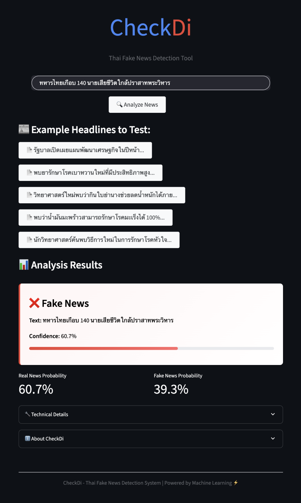

# CheckDi: Thai Fake News Verification Assistant

<p align="center">
  
  
  
</p>

<p align="center">
  
</p>

CheckDi is an AI-powered fake news verification assistant specifically designed for the Thai language. Leveraging machine learning techniques with real data from Thailand's Anti-Fake News Center (AFNC), CheckDi helps users identify potentially misleading information in Thai news content through an intuitive Google-like interface.

This project demonstrates a comprehensive AI development pipeline, from data collection and preprocessing to model training and deployment of a user-friendly web application.

## Key Features

- **High-Accuracy Classification**: SVM-based model achieving 81.36% accuracy for Thai fake news detection
- **Confidence Scoring**: Provides probability scores with visual confidence bars
- **Google-like Interface**: Clean, responsive web UI with intuitive design
- **Real-time Analysis**: Instant predictions with loading animations
- **Mobile Responsive**: Works seamlessly across desktop and mobile devices
- **Thai Language Optimized**: Specifically designed for Thai news content
- **Example Headlines**: Pre-loaded examples for quick testing
- **Technical Transparency**: Model details and prediction probabilities

## Architecture

CheckDi follows a 3-tier architecture for clear separation of concerns:

1. **Presentation Tier (Frontend)**: Streamlit-based interface for user interaction
2. **Logic Tier (Backend)**: AI model and prediction logic processing
3. **Data Tier**: Dataset from AFNC and trained model files

## Technology Stack

- **Language**: Python 3.9+
- **Machine Learning**: Scikit-learn, TF-IDF Vectorization, Support Vector Machine (SVM)
- **Data Science**: Pandas, NumPy, Joblib
- **Visualization**: Matplotlib, Seaborn, WordCloud
- **Web Framework**: Streamlit with custom CSS styling
- **Development Tools**: Jupyter Notebook, Conda/Mamba package management
- **Font Support**: Noto Sans Thai for proper Thai text rendering

## Setup and Installation

### Prerequisites

- Python 3.9 or higher
- pip package manager

### Installation Steps

1. Clone the repository:
   ```bash
   git clone https://github.com/Dhanabhon/checkdi.git
   cd checkdi
   ```

2. Set up the environment (recommended - using conda):
   ```bash
   # Using conda/mamba (recommended)
   conda env create -f environment.yml
   conda activate checkdi
   ```

   Or using pip:
   ```bash
   # Using pip (alternative)
   python -m venv venv
   source venv/bin/activate  # macOS/Linux
   # .\venv\Scripts\activate  # Windows
   pip install -r requirements.txt
   ```

## Quick Start

### Launch the Demo (Recommended)

The fastest way to get started:

```bash
python run_app.py
```

This will:
- Check all dependencies
- Verify the trained model exists
- Launch the web application at `http://localhost:8504`

### Train Your Own Model

If you want to train the model from scratch:

```bash
# 1. Prepare the data
python src/core/data_preparation.py

# 2. Train the model (offline SVM approach)
python train_offline.py

# 3. Generate visualizations
python src/core/visualize_data.py

# 4. Launch the app
python run_app.py
```

### Development Workflow

For development and experimentation:

```bash
# Interactive data exploration
jupyter notebook notebooks/02_data_exploration.ipynb

# Model training notebook
jupyter notebook notebooks/04_model_training.ipynb

# Direct Streamlit launch
streamlit run src/app.py
```

## Project Structure

```
checkdi/
├── README.md                    # This file
├── CLAUDE.md                    # Development guide for Claude Code
├── QUICK_START.md              # Quick start instructions
├── environment.yml             # Conda environment (recommended)
├── requirements.txt            # Pip requirements (alternative)
├── run_app.py                  # Application launcher with dependency checks
├── train_offline.py            # Model training script
├── assets/
│   └── screenshot-fake-news1.png  # Demo screenshot
├── data/
│   ├── processed/              # Processed datasets and model artifacts
│   ├── raw/                    # Raw AFNC dataset
│   └── visualization/          # Generated charts and word clouds
├── fonts/
│   └── Noto_Sans_Thai/        # Thai font files for proper rendering
├── models/
│   └── offline-thai-fakenews-classifier/  # Trained SVM model
├── notebooks/                  # Jupyter notebooks for development
│   ├── 01_data_acquisition.ipynb
│   ├── 02_data_exploration.ipynb
│   ├── 03_data_preparation.ipynb
│   ├── 03_data_visualization.ipynb
│   └── 04_model_training.ipynb
└── src/
    ├── app.py                  # Main Streamlit application
    ├── app_final.py           # Session-state-optimized version
    └── core/
        ├── data_preparation.py # Data processing pipeline
        ├── visualize_data.py   # Visualization generation
        ├── predictor_offline.py # Offline model predictor
        └── scraper.py          # Data collection utilities
```

## Demo Features

### Google-like Interface
- Clean, minimalist design inspired by Google Search
- Responsive layout that works on desktop and mobile
- Custom CSS styling with smooth animations

### Real-time Analysis
- Instant predictions with loading animations
- Visual confidence bars (green for real, red for fake)
- Detailed probability breakdowns

### Example Headlines
Try these sample headlines to test the system:
- `รัฐบาลเปิดเผยแผนพัฒนาเศรษฐกิจในปีหน้า` (Real news)
- `พบว่าน้ำมันมะพร้าวสามารถรักษาโรคมะเร็งได้ 100%` (Fake news)

## Model Performance

- **Accuracy**: 81.36% on test dataset
- **Algorithm**: Support Vector Machine (SVM) with TF-IDF vectorization
- **Training Data**: 2,700+ Thai news items from AFNC dataset
- **Features**: N-gram analysis (1-2 grams) with 5000 max features

## Future Improvements

- **Transformer Models**: Experiment with WangchanBERTa for potentially higher accuracy
- **URL-based Verification**: Enable users to paste news URLs for automatic content analysis
- **Multi-source Training**: Incorporate additional Thai news sources
- **Cloud Deployment**: Deploy to Hugging Face Spaces or cloud platforms
- **Batch Processing**: Add support for analyzing multiple headlines at once

## License

This project is licensed under the MIT License - see the [LICENSE](LICENSE) file for details.

## Author

Tom Dhanabhon